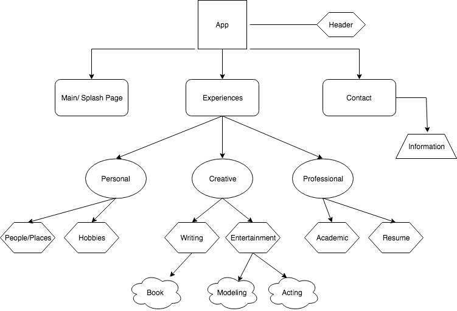

# _Personal Portfolio_

#### By _**Tavish OKeefe**_

## Description

_This application will do its best to promote the life and work of its creator._

## Specifications

* _**Build root component to hold movie objects and act as command center of application.**_
* _**Build model folder to construct movie objects.**_
* _**Create component to display objects.**_
* _**Create Explore component.**_
* _**Write HTML for Explore component.**_
* _**Create Redeem component.**_
* _**Write HTML for Redeem component.**_
* _**Create MyMovies component.**_
* _**Write HTML for MyMovies component.**_
* _**Create Search component.**_
* _**Write HTML for Search component.**_
* _**Create Log In component.**_
* _**Write HTML for Log In component.**_
* _**Create Get Started component.**_
* _**Write HTML for Get Started component.**_
* _**Create routs to various pages through app.routing.**_
* _**Refactor code to incorporate dynamic id's.**_
* _**Link application to Firebase.**_
* _**Create a data base within Firebase.**_
* _**Link to an API**_
* _**Link external API, movie information, to application.**_
* _**Link API to Firebase database.**_
* _**Style project to look like a working application.**_
* _**Launch application.**_

## _Setup/Installation Requirements_

* _Clone repository to your desktop_
* _Open in Atom, or text and source code editor of your choosing._
* _Run npm install from CLI._
* _Run npm run start from CLI._

## Known Bugs

_There are no known bugs at this time._

## Support and contact details

_Tavish OKeefe: okeefe.tavish@gmail.com_

## Technologies Used

* _JSX_
* _Javascript_
* _HTML_
* _eslint_

### License

Copyright (c) 2018, _Tavish O'Keefe_  

Permission is hereby granted, free of charge, to any person obtaining a copy
of this software and associated documentation files (the "Software"), to deal
in the Software without restriction, including without limitation the rights
to use, copy, modify, merge, publish, distribute, sublicense, and/or sell
copies of the Software, and to permit persons to whom the Software is
furnished to do so, subject to the following conditions:  

The above copyright notice and this permission notice shall be included in all copies or substantial portions of the Software.

THE SOFTWARE IS PROVIDED "AS IS", WITHOUT WARRANTY OF ANY KIND, EXPRESS OR
IMPLIED, INCLUDING BUT NOT LIMITED TO THE WARRANTIES OF MERCHANTABILITY,
FITNESS FOR A PARTICULAR PURPOSE AND NONINFRINGEMENT. IN NO EVENT SHALL THE
AUTHORS OR COPYRIGHT HOLDERS BE LIABLE FOR ANY CLAIM, DAMAGES OR OTHER
LIABILITY, WHETHER IN AN ACTION OF CONTRACT, TORT OR OTHERWISE, ARISING FROM,
OUT OF OR IN CONNECTION WITH THE SOFTWARE OR THE USE OR OTHER DEALINGS IN THE
SOFTWARE._